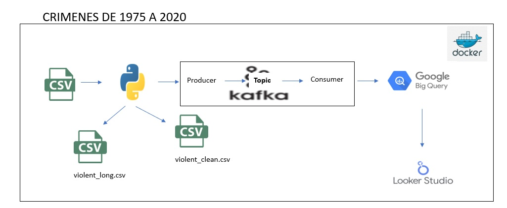
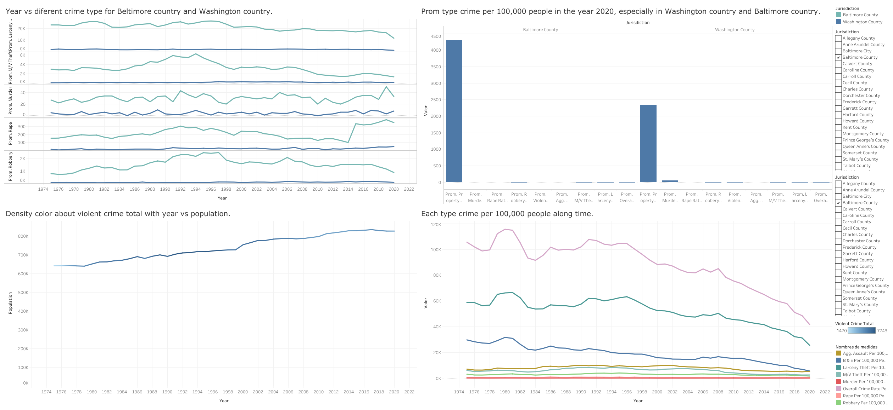
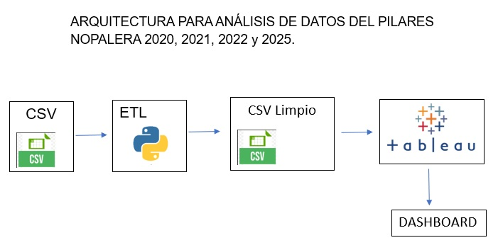
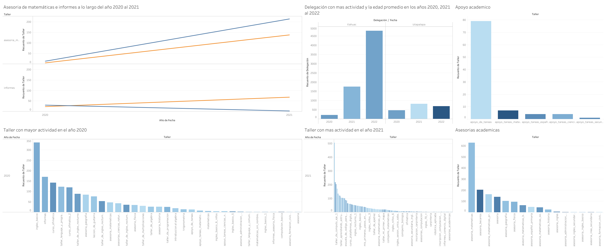
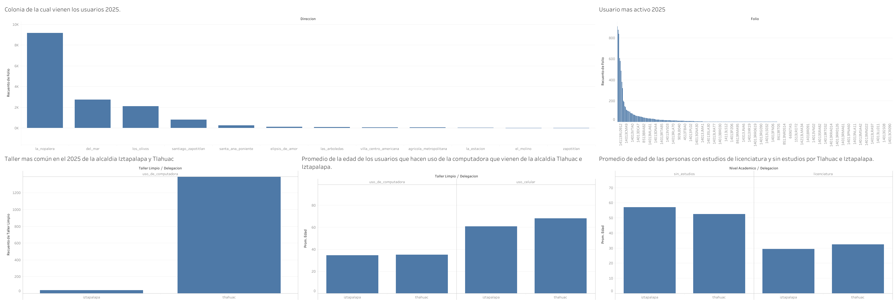
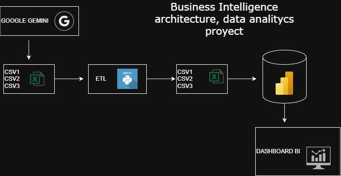
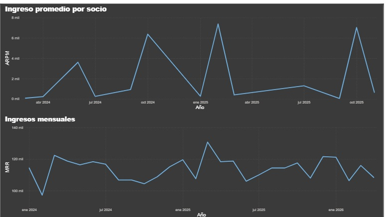

# 👋Hola, bienvenido a mi perfil

<!-- Apasiado+de+las+tecnologias+matematicas+ciencia -->

# Sobre mí

🎓 Estudios: Estudie la licenciatura en física en la Universidad Autonoma Metropolitana, unidad Iztapalapa y Metematicas en la Universidad Abierta y a Distancia de México. 

🚀 Motivación: Apasionado por la ciencia, analisis e ingenieria de datos y el aprendizaje automático desde 2022.  

🏡 Ciudad de México, México.  

📚 Formación autodidácta y profesional: Data Visualization & analytic in Tableau, Applied Python Data Engineering Specialization, Scripting with Python and SQL for Data Engineering, Apache Kafka For Beginners, Scripting with Python and SQL for Data Engineering, Advanced Data Engineering, Google Cloud Data Engineering (Udemy) – BigQuery, Looker Studio. 

📔 Lenguas: Inglés B2+ de forma autodidacta. 

 

Hola, me llamo Eduardo, tengo 27 años y he trabajado de forma autodidacta y constantemente estos ultimos 3 años en analisis, ciencia e ingenieria de datos, haciendo proyectos por cuenta propia así como experiencia profesional al analizar datos sobre la educación. 

Me encanta todo este mundo de la tecnologias, ciencia, ingenieria y analisis de datos, he aprendido por cuenta propia Kafka para simular eventos en tiempo semi real, Docker para dockerizar mis proyectos y Airflow para orquestar tareas en arquitecturas. 

Tengo experiencia práctica y profesional trabajando con:

- Python (Pandas, NumPy, Matplotlib)

- SQL (BigQuery y PostgreSQL) para análisis y manejo de bases de datos

- Tableau, Looker Studio y Metabase para visualización interactiva de datos

- GitHub para Documentar mis proyectos 

- Kafka para simular datos en tiempo semi real
  
- Docker para dockerizar mis arquitecturas

- Airflow para orquestar el código

- Y un poco sobre la nube como BigQuery y LookerStudio 

Tengo múltiples proyectos hechos en Python, PostgreSQL, BigQuery, Kafka, Docker, Airflow, Metabase y Tableau sobre análisis e ingenieria de datos. Te invito a verlos en la sección correspondiente más abajo y en sus respectivos repositorios. Adicionalmente, tengo otros conocimientos teóricos como; estadística y probabilidad, fundamentos de series de tiempo, finanzas básicas, fundamentos de POO, fundamentos de BigQuery y Looker Studio, entre otros. Además, me mantengo actualizado y en constante formación autodidacta para aprender y solucionar problemas de manera optima y eficiente. 

Actualmente, estoy desarrollando proyectos de:

- Estudio de comercios y negocios en la Ciudad de México utilizando Python, Docker, Airflow, PostgreSQL y Metabase que tiene como fin poder hacer un analisis urbano en dicha ciudad.
- 
Objetivo profesional.

Busco integrarme en un equipo donde pueda aplicar mis habilidades profesionales y tecnicas para optimizar recursos y encontrar soluciones. 

</h4>

<!--h1 without bottom border-->

  <ul align="center">
    
<h2 style="display: inline-block">Tecnologías que he usado👨🏻‍💻</h2>

  </ul>

<!--tech stack icons-->

  

              

## Habilidades destacadas

| Tecnología o habilidad | Nivel |
|------------------------|-------|
|  | 🟦🟦🟦🟦🟦🟦🟦🟦⬜⬜ 85% |
|  | 🟧🟧🟧🟧🟧🟧🟧⬜⬜⬜ 50% |
|  | 🟩🟩🟩🟩🟩🟩🟩🟩⬜⬜ 80% |
|  | 🟥🟥🟥🟥🟥🟥🟥⬜⬜⬜ 75% |
|  | 🟨🟨🟨🟨🟨🟨🟨⬜⬜⬜ 70% |
|  | Intermedio (B2+) |
|  | 🔵🔵🔵🔵🔵🔵🔵⬜⬜⬜ 70% |
|  | 🟠🟠🟠🟠🟠⬜⬜⬜⬜⬜ 50% |
|  | 🟣🟣🟣🟣⬜⬜⬜⬜⬜⬜ 40% |
|  | 🟠🟠🟠🟠⬜⬜⬜⬜⬜⬜ 40% |
|   | 🟩🟩🟩⬜⬜⬜⬜⬜⬜⬜ 30% |

## Habilidades Blandas

- 🧠 Pensamiento analítico, abstracto, riguroso y formal gracias a mis estudios de física y matemáticas.

- ❕ Proactividad (he contactado y formado un equipo de estudio de ciencia de datos para llevar a cabo proyectos y cursos)

- 📢 Comunicación efectiva 

- 🤝 Trabajo en equipo y colaboración

- ⏰ Gestión del tiempo y organización (desde 2022 he estudiado de forma autodidacta y eficiente, optimizando el tiempo de forma estratégica)

- 🧘 Curiosidad y aprendizaje continuo (apasionado desde las ciencias hasta la tecnología, siempre aprendiendo nuevas tecnologías y profundizando en las actuales)

- 🧩 Resolución de problemas (desde problemas científicos hasta tecnológicos, enfrentándome con datos sucios, analísis de datos en tiempo semi real, dockerizar codigo, orquestarlo y documentarlo en ingles y español)

- 🧠 Toma de decisiones basada en evidencia (capacidad de transformar el análisis en insights accionables, evitando quedarse únicamente en la complejidad técnica)

# 🚔 Simulación de eventos utilizando Kafka | Data Engineering Pipeline

## 📌 Objetivo del proyecto

Desarrollar un pipeline de ingeniería de datos capaz de simular eventos en tiempo semi-real utilizando Apache Kafka, procesar información sobre crímenes en Estados Unidos y visualizar métricas utilizando BigQuery y Looker Studio.

---

## 🛠️ Tecnologías utilizadas

  

- Python  
- Apache Kafka  
- Docker  
- BigQuery  
- Looker Studio  
- Pandas  

---

## 🧱 Arquitectura del proyecto

  

---

## 🎥 Videos del proyecto

<table>
<tr>

<td align="center">

## 🎥 Explicación en Español

### 🇺🇸 English Version

</td>

</tr>
</table>

---

## 📊 Dashboard y visualizaciones

### Dashboard en Looker Studio

---

## 📂 Repositorio del proyecto

🔗 [Ver repositorio completo](https://github.com/EduardoGarcia12/Violent-Crime-Data-Pipeline-End-to-End-)

---

## ⚙️ Flujo de trabajo del pipeline

1. Extracción de datos históricos sobre crímenes en Estados Unidos en formato CSV.
2. Limpieza, validación y transformación de datos utilizando Python y Pandas.
3. Simulación de eventos en tiempo semi-real mediante Kafka Producer.
4. Procesamiento de eventos utilizando Kafka Consumer.
5. Carga de datos procesados en BigQuery.
6. Visualización y análisis de métricas en Looker Studio.
7. Contenerización completa utilizando Docker Compose.

---

## 📈 Resultados obtenidos

- Identificación de los autobuses que llegan a una parada en función de su ID. 
- Simulación exitosa de eventos utilizando Apache Kafka.
- Integración funcional entre Kafka, BigQuery y Looker Studio.
- Construcción de un pipeline End-To-End orientado a ingeniería de datos.

---

## 🧠 Qué aprendí

- Arquitectura general de proyectos de ingeniería de datos.
- Procesos ETL utilizando Python.
- Manejo de eventos en tiempo semi-real con Kafka.
- Integración de BigQuery con herramientas de visualización.
- Contenerización de arquitecturas utilizando Docker.
- Diseño de dashboards para extracción de insights.

---

## 🚀 Futuras mejoras

- Incorporar Apache Airflow para automatización y orquestación.
- Implementar procesamiento distribuido.
- Integrar datos recientes en tiempo real.
- Crear modelos predictivos sobre comportamiento delictivo.
- Escalar consumidores Kafka utilizando particiones.

---

# 🚔 Análisis de talleres, edades y resago educativo en PILARES, TLAHUAC, CDMX | Data Analyze

## 📌 Objetivo del proyecto

Analizar datos de Pilares Nopalera de los años 2020, 2021, 2022 y 2025 para observar el resago educativo, talleres mas demandados y las edad promedio de los usuarios. Esto para implementar acciones pedagogicas y "motivar" a las personas a continuar con sus estudios de educación basica, media superior y superior. 

---

## 🛠️ Tecnologías utilizadas

  

- Python
- Tableau
- Excel 
- Pandas  

---

## 🧱 Arquitectura del proyecto

  

---

## 🎥 Videos del proyecto

<table>
<tr>

<td align="center">

## 🎥 Explicación en Español

### 🇺🇸 English Version

</td>

</tr>
</table>

---

## 📊 Dashboard y visualizaciones

### Dashboard en Looker Studio

---

## 📂 Repositorio del proyecto

🔗 [Ver repositorio completo](https://github.com/EduardoGarcia12/An-lisis-de-datos-sobre-la-educaci-n-en-la-Alcald-a-Tlahuac-Ciudad-de-M-xico)

---

## ⚙️ Flujo de trabajo del pipeline

1. Extracción de datos históricos sobre los usarios en el Pilares Nopalera de los años 2020, 2021, 2022 y 2025. 
2. Limpieza, validación y transformación de datos utilizando Python y Pandas.
3. El proceso ETL nos genera un archivo CSV limpio de mis datos. 
6. Visualización y análisis de los datos con Tableau.
---

## 📈 Resultados obtenidos

- En promedio las personas jovenes entre la edad 15 a 14 años venian por cursos de computación y talleres de matemáticas. 
- Adultos mayores entre 60 y 55 años no tenian ningun tipo de educacion, mientras que las personas adultas entre 29 y 30 años tenian estudios superiores. 
- Habían personas que venian de la delegación Iztapalapa, ahí es donde se concentraba un poco mas que en Tlahuac el rezago educativo. 
- Construcción de un pipeline ETL con ayuda de Python. 

---

## 🧠 Qué aprendí

- Arquitectura basica para analizar datos. 
- Procesos ETL utilizando Python.
- Manejo de Tableau para organizar la información. 
- Diseño de dashboards para la toma de decisiones. 

---

## 🚀 Futuras mejoras

- Incorporar los datos de los años 2026 para contrastar con los anteriores. 
- Contrastar con otras alcaldias. 
- Crear modelos predictivos sobre comportamiento de los talleres de matemáticas. 
- Escalar el proyecto, pero esto requiere acudir a otros PILARES para tener acceso a esa información. 

---

# 🚔 Análisis de KPI'S para un gimnasio | Data Analyze BI 

## 📌 Objetivo del proyecto

En este proyecto vamos a desarrollar un modelo estrella muy pequeño e implementar el proceso ETL para extraer, transformar y cargar los datos en Power BI para obtener el chunk, la retanción de clientes, los ingresos promedios a lo largo del 2024, 2025 y 2026. 

---

## 🛠️ Tecnologías utilizadas

  

- Python
- Power BI
- Excel 
- Pandas  

---

## 🧱 Arquitectura del proyecto

  

---

## 🎥 Videos del proyecto

<table>
<tr>

<td align="center">

## 🎥 Explicación en Español

### 🇺🇸 English Version

</td>

</tr>
</table>

---

## 📊 Dashboard y visualizaciones

### Dashboard en Looker Studio

---

## 📂 Repositorio del proyecto

🔗 [Ver repositorio completo](https://github.com/EduardoGarcia12/An-lisis-de-datos-BI-)

---

## ⚙️ Flujo de trabajo del pipeline

1. Generación de los datos con ayuda de Gemini. 
2. Limpieza, validación y transformación de datos utilizando Python y Pandas.
3. El proceso ETL nos genera tres archivos CSV limpio de mis datos. 
6. Visualización y análisis de los datos con Power Bi.
---

## 📈 Resultados obtenidos

- El Chunk con valor mas alto fue en Abril del año 2026 con un 14%, mientras que la retención de los usuarios fue de 79% en el mes de julio del 2025.  
- Cuando graficamos el ARPM y MRR a lo largo del tiempo vimos que el mayor valor del ARPM fue en Febrero del 2025, con un valor de 7391.71, suposimos que la mensualidad se cobraba en promedio 400 pesos, entonces, como este 7391.71 es mayor a 400, esto es fue una señal positiva de que los complementos funcionan bien. 
- Mientras que el MMR con mayor valor fue en el mes de Marzo del 2025 con un valor de 130800 pesos, esto recordando que son los ingresos que generan los usuarios activos.  

---

## 🧠 Qué aprendí

- Calcular medidas usando DAX en Power BI. 
- Procesos ETL utilizando Python.
- Manejo de Power BI para organizar la información. 
- Diseño de dashboards para la visualización de KPI'S.
- Implementar el modelo estrella.  

---

## 🚀 Futuras mejoras

- Tratar de escalar el problema integrando mas tablas al modelo estrella. 
- Crear modelos predictivos en función de las KPI'S que calculamos en Power BI.  

---

## 🌐 Conecta conmigo

  

  

  

